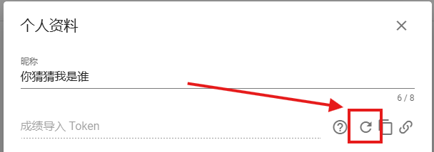
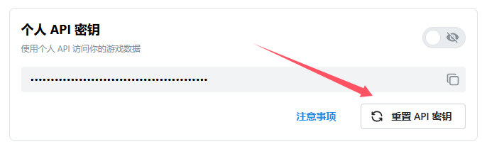
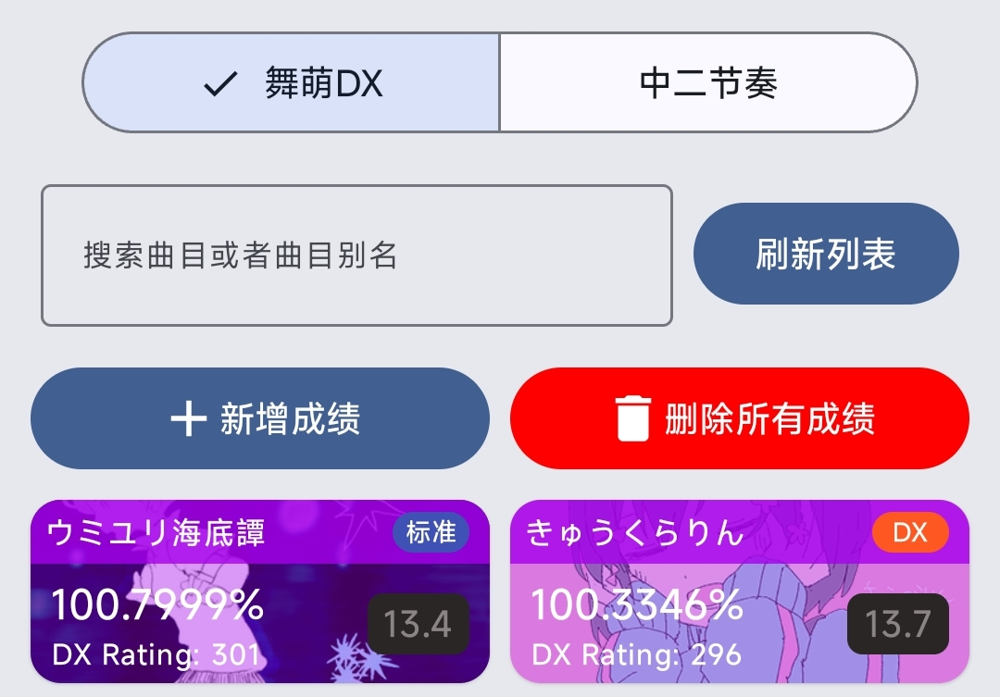

# Maiupload — 使用说明

> 基于 [落雪查分器](https://github.com/Lxns-Network/maimai-prober-frontend) 与 [水鱼查分器](https://www.diving-fish.com/maimaidx/prober/) 的安卓成绩导入工具。
> 通过本地 VPN 拦截微信游戏流量，解析 maimai DX / CHUNITHM 成绩页面并上传至第三方查分器或本地 Room 数据库。

**仓库地址**：<https://github.com/Te-River/Maiupload>

---

## 目录

- [基础功能：导入成绩到查分器](#基础功能导入成绩到查分器)
- [进阶功能：Rival 同步（类型一）](#进阶功能rival-同步类型一)
- [进阶功能：本地成绩管理](#进阶功能本地成绩管理)
- [设置界面详解](#设置界面详解)
- [日志系统](#日志系统)
- [其他](#其他)

---

## 基础功能：导入成绩到查分器

### 水鱼 API

1. 打开水鱼查分器并登录，点击 **"编辑个人资料"** 按钮
2. 点击箭头指向的按键对成绩导入 Token 进行重置或生成 **（若你已有成绩导入 Token，请跳过此步）**
   
3. 点击 ***重置 Token 旁边的按钮*** 来 **复制该 Token** 并打开 Maiupload
4. 接下来请看 [通用步骤](#通用步骤)

### 落雪 API

- **Token 方式**：打开落雪查分器并登录，点击侧边栏中的 **"账号详情"** 按钮，点击箭头指向的按钮对个人 API 密钥进行重置或生成 **（若你已有个人 API 密钥，请跳过此步）**，点击 ***重置 API 密钥上面的按钮*** 来 **复制该密钥** 并打开 Maiupload
  
- **OAuth 方式（推荐）**：同步页选择 **落雪查分器** 后点击 **OAuth** 切换，点击 **"授权"** 按钮打开授权链接，在浏览器中登录并同意后获取 **授权码**，将授权码填回应用即完成绑定，无需手动复制管理 API 密钥
- 接下来请看 [通用步骤](#通用步骤)

### 通用步骤

1. ***再次确认你需要导入的查分器以及 成绩导入 Token / 个人 API 密钥 / OAuth 授权 正确无误***
2. ***再次确认你需要导入的游戏 舞萌 / 中二节奏***
3. ***复制 Hook 链接后点击开始劫持（第一次使用需要下载少量文件）请求创建 VPN 连接时请同意（重要!!）***
4. ***启动到微信，并找一个安全的聊天窗口打开（最好是发给你自己或文件传输助手）***
5. ***点进链接即可开始导入***

---

## 进阶功能：Rival 同步

Rival 同步支持直接拉取指定 **对手 (Rival)** 的成绩并上传到当前选定的查分器（落雪 / 水鱼），无需 VPN 抓包。

> 仅支持舞萌 DX（中二节奏无 Rival API），切换游戏为中二节奏时同步页会自动隐藏 Rival 按钮。

### 第一步：获取 userId（QR 鉴权）

1. 进入设置页 **成绩抓取设置 → Rival 设置**
2. 填写 **机台号 (keychip)**、**鉴权网址 (authServerUrl)**、**Auth Salt**
3. 点击 **"用 QR 二维码鉴权拿 userId"** 按钮，扫描游戏内 Rival 二维码，成功后 userId 自动保存

### 第二步：配置同步参数

在 **Rival 设置** 页填写以下字段：

| 字段 | 说明 |
|------|------|
| 游戏服务器网址 | 含尾斜杠的基础 URL |
| 哈希 | 端点哈希值，需手动计算填写 |
| 混淆参数 | 加密混淆参数 |
| 加密 Key / 加密 IV | AES-CBC 加密参数 |
| 编码版本 | 请求头，需手动填写 |
| 鉴权网址 | QR 鉴权节点，直接使用不拼接 |
| Auth Salt | 鉴权签名盐 |

### 第三步：同步

1. 回到同步页，选择 **落雪查分器**（OAuth 或 Token）或 **水鱼查分器**
2. 点击 **"通过 Rival 同步"** 按钮，按钮会变为进度条
3. 流程提示：
   ```
   开始拉取成绩
   拉取成绩中，已拉 1280 条
   拉取完成，共 1280 条
   开始上传至落雪查分器
   共剔除 7 首被删除乐曲   (仅当有剔除时显示)
   成功上传 1273 首至落雪查分器
   ```
   > 本地曲库不存在的乐曲会在上传前剔除（只报数量，明细写入日志），避免整批提交被查分器拒绝。

---

## 进阶功能：本地成绩管理

在 Maiupload 中，你可以选择将你的成绩导入进本地数据库，以进行本地化成绩查询。

若你需要使用本地成绩管理功能，请在导入成绩时点击 **"本地"** 选择框，并按正常步骤导入即可；或选择对应的查分器后，点击 **"从选定的查分器获取数据"** 按钮，MaiproberPlus 会自动从对应的查分器获取成绩。

***这需要你设置好对应的 成绩导入 Token / 个人 API 密钥 / OAuth 授权（重要!!）***



点击应用下方 Dock 栏的 **"成绩管理"** 按钮进入本地成绩管理页面，这里以 ***舞萌 DX*** 为例：

1. **搜索曲目** — 可根据 **曲目名称 / 曲目别名** 搜索你的成绩
2. **新增成绩** — 可在你的 **本地数据库记录** 中新增一条成绩
3. **删除所有成绩** — 可删除你 **本地数据库记录** 中的所有成绩

---

## 设置界面详解

| 设置项 | 说明 |
|--------|------|
| Token 设置 | 可分别设置 **成绩导入 Token / 个人 API 密钥** |
| 成绩抓取设置 | 可分别设置 **舞萌 / 中二节奏** 的同步设置（如只同步舞萌 DX 的 Master 难度，或只同步中二节奏的 World's End 难度等）。其中 **Rival 设置** 为二级菜单页，配置类型一（Rival 同步）的鉴权网址 / 服务器网址 / 加密参数 |
| 成绩展示设置 | 调整成绩展示卡片和列表的样式 |
| 更新歌曲信息与别名 | 当游戏有 **版本更新** 时，抓取最新的歌曲信息 |
| 成绩缓存本地 | 设置是否每次上传到查分器时都缓存一份成绩到 **本地数据库** |
| 清除应用缓存 | 清除歌曲缩略图、ktor 请求等缓存信息 |

---

## 日志系统

应用默认在后台记录日志到内部存储 `filesDir`，无需手动开启，便于反馈问题时排查：

| 文件 | 内容 |
|------|------|
| `debug.log` | 全量调试日志：所有 Log 输出 + 网络请求/响应（含请求头、状态码） |
| `sync.log` | Rival 同步专用：拉取 / 剔除 / 上席 / 鉴权全流程节点 |
| `error.log` | 报错日志 + 未捕获崩溃的堆栈 |

取日志（需 adb）：

```
adb exec-out run-as io.github.teriver.maiupload cat files/debug.log > debug.log
```

---

## 其他

- 头像 / 姓名框对照表：[点击查看](https://rif.skydynamic.top/)
